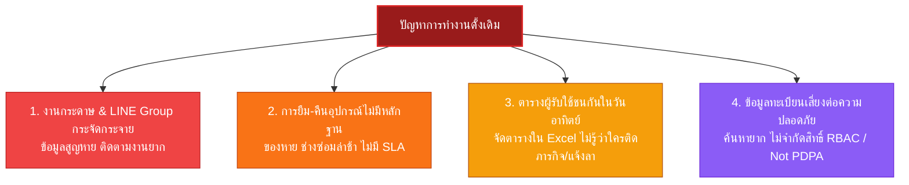
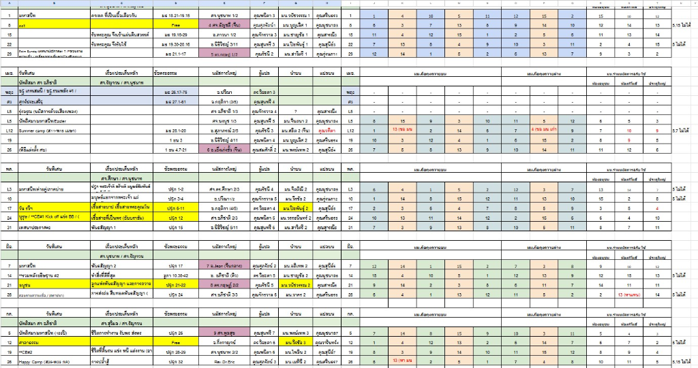
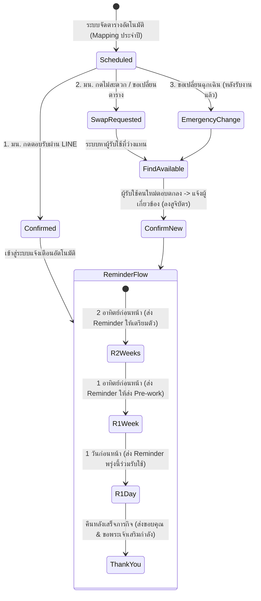
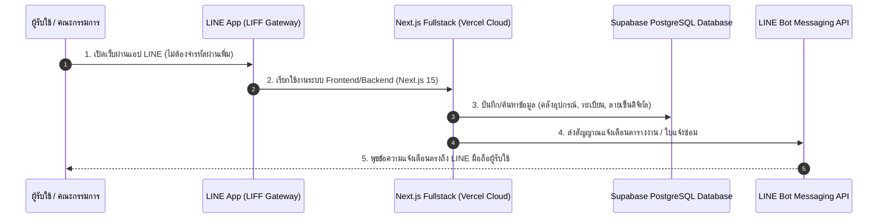
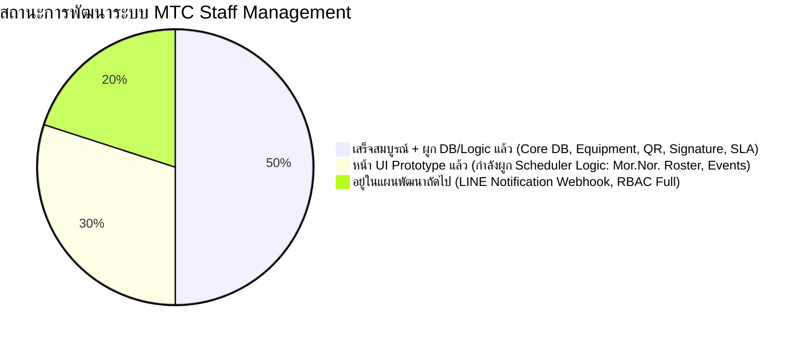

# 📢 Kick-off Presentation Blueprint & Speaker Script (Executive Version)
## โครงการระบบบริหารจัดการบุคลากรและพันธกิจ คริสตจักรไมตรีจิต (MTC Staff Management System)

---

> 🎯 **วัตถุประสงค์ของสไลด์ชุดนี้:** 
> เพื่อสื่อสารกับคณะอนุกรรมการ (ซึ่งส่วนใหญ่ไม่มีพื้นฐานด้าน Technical) ให้เข้าใจถึง **จุดเริ่มต้น แนวคิด Pain Point**, **สถาปัตยกรรมระบบ (ARCHITECTURE.md)**, **เหตุผลในการตัดสินใจเลือกเทคโนโลยี (DECISION.md)**, **ขอบเขตการทดสอบ PoC (PoC_Scope.md)**, **Business Logic การจัดตารางปรนนิบัติ (Requirement for Scheduler .pdf)**, และ **สถานะความคืบหน้าของระบบตามความเป็นจริง (แยกส่วนที่ผูก Logic แล้ว vs ส่วน UI Prototype)** โดยใช้ภาษาสื่อสารง่าย ไม่ซับซ้อน และเน้นประโยชน์ต่อพันธกิจคริสตจักรเป็นหลัก

---

## 📋 ภาพรวมวาระการประชุม (Agenda Summary)

```mermaid
gantt
    title วาระการประชุม Kick-off อนุกรรมการ
    dateFormat X
    axisFormat %s
    section 1. แนวคิด & Pain Point
    1. Background & Pain Points : active, 0, 15
    section 2. As-Is vs To-Be Roster
    2. เปรียบเทียบตารางรับใช้ As-Is : 15, 30
    section 3. Scheduler Business Logic
    3. Business Logic ตารางรับใช้ (Scheduler) : 30, 50
    section 4. Architecture & Decisions
    4. สถาปัตยกรรม & การตัดสินใจเลือก Stack : 50, 70
    section 5. PoC Scope & Reality Update
    5. ขอบเขต PoC & สถานะจริงระบบ : 70, 85
    section 6. แผนงาน & Q&A
    6. Next Steps & Q&A : 85, 100
```

---

# 🖼️ รายละเอียดสไลด์ทีละหน้า (Slide-by-Slide Deck & Script)

---

### Slide 1: หน้าปก (Title Slide)
- **หัวข้อ:** Kick-off การพัฒนาระบบบริหารจัดการบุคลากรและพันธกิจ (MTC Staff Management System)
- **ย่อย:** จากปัญหาในอดีต สู่ออฟฟิศดิจิทัลคริสตจักรไมตรีจิตที่สะดวกรวดเร็ว โปร่งใส และปลอดภัย
- **ผู้นำเสนอ:** ทีมพัฒนาเทคโนโลยี คริสตจักรไมตรีจิต
- **องค์ประกอบภาพ:** โลโก้คริสตจักรไมตรีจิต + ภาพจำลอง Dashboard บนหน้าจอโน้ตบุ๊กและมือถือ

---

### Slide 2: จุดเริ่มต้นและแนวคิดโครงการ (Background & Core Concept)

- **วิสัยทัศน์ (Vision):** สร้าง **"ศูนย์กลางข้อมูลดิจิทัลหนึ่งเดียว" (Single Digital Church Platform)** เพื่อสนับสนุนทีมงาน ศิษยาภิบาล และผู้รับใช้ ให้สามารถปฏิบัติงานพันธกิจร่วมกันได้ราบรื่นที่สุด ผ่านแอปพลิเคชัน LINE ที่ทุกคนคุ้นเคย
- **ทำไมต้องทำตอนนี้?** คริสตจักรมีการเติบโตขึ้น พันธกิจและอุปกรณ์มีจำนวนมากขึ้น การบริหารจัดการด้วยวิธีเดิมไม่เพียงพอต่อการขยายตัวขององค์กรอีกต่อไป

> 🗣️ **คำพูดแนะนำสำหรับผู้พูด (Speaker Script):**
> *"เรียนคณะอนุกรรมการทุกท่าน จุดเริ่มต้นของโครงการนี้เกิดจากการที่เรามองเห็นว่า คริสตจักรไมตรีจิตของเราเติบโตขึ้นทุกวัน มีพันธกิจเพิ่มขึ้น อุปกรณ์เพิ่มขึ้น และผู้รับใช้เพิ่มขึ้น แต่เครื่องมือในการบริหารจัดการเรายังคงใช้วิธีแบบเดิมๆ วันนี้เราจึงตั้งใจสร้างระบบที่จะเข้ามาเป็น 'ออฟฟิศดิจิทัล' ช่วยให้ทุกคนทำงานได้ง่ายขึ้น ผ่าน LINE บนมือถือที่ทุกคนมีอยู่แล้วครับ"*

---

### Slide 3: 4 ปัญหาหลักที่เราต้องการเปลี่ยนแปลง (The 4 Real Pain Points)

1. **🔴 เอกสารกระดาษ & สื่อสารใน LINE Group กระจัดกระจาย:** คำขออนุมัติ การแจ้งลา หรือการตามงาน ตกหล่นในแชตกลุ่ม ค้นหาย้อนหลังไม่ได้
2. **🔴 อุปกรณ์ยืม-คืนลอยตัว ไม่มีหลักฐาน:** ไมโครโฟน โปรเจกเตอร์ สายสัญญาณ ยืมไปแล้วไม่รู้ว่าอยู่ที่ใคร เมื่ออุปกรณ์ชำรุดไม่มีใครแจ้ง ช่างซ่อมเสร็จเมื่อไหร่ไม่มีใครรู้
3. **🔴 ตารางรับใช้ (Serving Roster) ใน Excel มีปัญหาชนกัน:** คณะจัดตารางไม่ทราบสถานะการลาหรือภารกิจอื่นของผู้รับใช้ ทำให้วันอาทิตย์ขาดคนรับใช้หน้างาน
4. **🔴 ข้อมูลทะเบียนคริสตจักรเสี่ยงไม่ปลอดภัย:** ข้อมูลสมาชิกและบุคลากรเก็บกระจัดกระจาย ค้นหายาก ไม่มีการจำกัดสิทธิ์ตามบทบาท เสี่ยงต่อการรั่วไหล

---

### Slide 4: ตารางรับใช้แบบเดิม (As-Is Roster vs To-Be Platform)

- **ภาพรวมตารางเดิม (As-Is):**
  - จัดตารางผ่านไฟล์ **Excel Spreadsheet** แยกรายเดือน/รายสัปดาห์ 
  - ข้อมูลมีความซับซ้อน ตัวหนังสือและโค้ดตัวเลขกระจัดกระจาย
  - **ข้อจำกัด:** ไม่สามารถเช็กได้ว่าผู้รับใช้ในตารางติดภารกิจอื่น แจ้งลา หรือติดงานคริสตจักรหรือไม่ เมื่อมีการย้ายตารางต้องพิมพ์แก้ไขใหม่และส่งไฟล์ใหม่เข้ากลุ่ม LINE ซ้ำๆ
- **เป้าหมายใหม่ (To-Be System):**
  - จัดตารางผ่าน **ระบบ MTC Staff Management บน Web & LINE** 
  - ระบบดึงรายชื่อบุคลากรจากฐานข้อมูล พร้อมตรวจสอบสถานะการติดภารกิจ/การลาให้อัตโนมัติ ป้องกันตารางชนกัน 100%

---

### Slide 5: Business Logic การจัดตารางปรนนิบัติ (Requirement for Scheduler)

*(อ้างอิงจากข้อกำหนดในเอกสาร Requirement for Scheduler .pdf)*

- **กลุ่มผู้ใช้งานหลัก (User Roles & Scale):**
  - **มัคนายก (มน.):** 15 คน | **ศิษยาภิบาล (ศบ.):** 5 คน
  - *(รองรับการขยายผลสู่ ทีมดนตรี, ทีมภาพและเสียง, ทีมคนแปล, ทีมต้อนรับ)*

- **เงื่อนไขอัตโนมัติในการจัดตาราง (Conditional Arrangement Rules):**
  1. **Main Logic 1 (Mapping วันสำคัญประจำฝ่าย):** มน. ประจำฝ่ายเป็นผู้นำนมัสการในวันของฝ่ายตนเอง (เช่น วันปีใหม่ -> ประธาน, วันถวายบุตร -> มน. คริสเตียนศึกษา, วันอนุชน -> มน. อนุชน ฯลฯ)
  2. **Main Logic 2 (ลำดับความสำคัญสถานที่ - Priority Order):** จัด มน. รับใช้ไม่ซ้ำกันในแต่ละอาทิตย์ โดยเรียงลำดับ Priority 1: โบสถ์บน/โบสถ์ล่าง $\rightarrow$ Priority 2: ประตูโบสถ์ $\rightarrow$ Priority 3: อนุชน ทิโมธี
  3. **Main Logic 3 (โควตารับใช้):** กำหนดให้ มน. รับใช้ **2 อาทิตย์ต่อเดือน** เพื่อกระจายภาระงานอย่างเหมาะสม
  4. **Minor Logic (หลีกเลี่ยงตารางชน):** ตรวจสอบว่า มน. ไม่ติดงานรับใช้อื่นๆ ในวันเดียวกัน

---

### Slide 6: กระบวนการตอบรับและการแจ้งเตือนอัตโนมัติ (Scheduler Workflow Scenarios)

- **ระบบการแจ้งเตือนตามลำดับเวลา (Automated Reminder Timeline):**
  - 🔔 **2 อาทิตย์ก่อนหน้า:** ส่งข้อความเตือนให้เตรียมตัวรับใช้
  - 🔔 **1 อาทิตย์ก่อนหน้า:** ส่งข้อความเตือนให้ส่ง Pre-work / ข้อมูลสูจิบัตร ให้กับทีมที่เกี่ยวข้อง
  - 🔔 **1 วันก่อนหน้า:** ส่งข้อความเตือน *"พรุ่งนี้เราร่วมรับใช้ด้วยกัน"*
  - ❤️ **คืนหลังเสร็จภารกิจ:** ส่งข้อความขอบคุณและขอพระเจ้าเสริมกำลังผู้รับใช้

---

### Slide 7: สถาปัตยกรรมระบบ และการไหลของข้อมูล (ARCHITECTURE.md)

---

### Slide 8: เหตุผลทางเทคนิคในการเลือกเทคโนโลยี (DECISION.md)

| การตัดสินใจหลัก | เทคโนโลยีที่เลือก | เหตุผลทางเทคนิค (Technical Rationale) | ประโยชน์ต่อคริสตจักร |
| :--- | :--- | :--- | :--- |
| **1. รวมศูนย์การพัฒนา** | Next.js 15 (Fullstack) | ใช้ภาษา JavaScript/TypeScript ทั้งหน้าบ้านและหลังบ้าน ไม่ต้องแยกกิลด์นักพัฒนา | ดูแลรักษาง่าย ประหยัดงบส่งต่อโค้ดง่าย |
| **2. ฐานข้อมูลจัดการสำเร็จ** | Supabase (PostgreSQL) | Managed DB บน Cloud มีระบบสิทธิ์และ Security Built-in | คริสตจักรไม่ต้องซื้อตู้เซฟ Server มาดูแลเอง |
| **3. ประตูเข้าใช้งาน** | LINE LIFF & Bot SDK | เชื่อมต่อกับ LINE Ecosystem ที่ทุกคนมีอยู่แล้ว | ผู้รับใช้ไม่ต้องโหลดแชท/แอปอื่นเพิ่ม |
| **4. ระบบคลาวด์และ CI/CD** | Vercel + GitHub | อัปเดตโค้ดและปรับโครงสร้างอัตโนมัติผ่าน GitHub | ระบบไม่มีวันล่ม เสถียรและปลอดภัย 99.9% |

---

### Slide 9: ขอบเขตและเป้าหมายการทดสอบ PoC (PoC_Scope.md)

- **เกณฑ์ความสำเร็จของ PoC (Success Criteria):**
  1. ✅ เปิดเว็บแอปพลิเคชันผ่าน LINE LIFF ได้สำเร็จโดยไม่ต้องล็อกอินซ้ำ
  2. ✅ หน้าเว็บสามารถเรียก API ดึงและบันทึกข้อมูลเข้า Supabase PostgreSQL ได้ถูกต้อง
  3. ✅ มีระบบยืม-คืนอุปกรณ์สแกน QR Code พร้อมเซ็นชื่อดิจิทัลได้จริง
  4. ✅ LINE Bot สามารถรับ Webhook Event และตอบกลับแจ้งเตือนผู้ใช้งานได้อัตโนมัติ

---

### Slide 10: สรุปสถานะความคืบหน้าระบบตามความเป็นจริง (Honest System Status)

*(สื่อสารตรงไปตรงมาว่าส่วนไหนผูก Logic ใช้งานได้จริงแล้ว และส่วนไหนเป็น UI Prototype กำลังผูก Logic)*

---

### Slide 11: เจาะลึกสถานะระบบ - ส่วนที่ผูก Logic & Database สำเร็จแล้ว (Backend Implemented)

- **✅ 1. โครงสร้างฐานข้อมูล PostgreSQL (Prisma + Supabase):** วาง Schema รองรับข้อมูลบุคลากร อุปกรณ์ การยืมคืน และใบแจ้งซ่อมเรียบร้อย 100%
- **✅ 2. ระบบคลังอุปกรณ์ & QR Code (Equipment Catalog API):** มีระบบจัดการข้อมูลอุปกรณ์ สแกน QR Code เพื่อดึงข้อมูลจริงจาก Database
- **✅ 3. ระบบยืม-คืนอุปกรณ์ พร้อมลายเซ็นดิจิทัล (Digital Handover API):**
  - มี Logic หลังบ้านบันทึกภาพถ่ายและ **ลายเซ็นดิจิทัลจริง (Base64 Signature)** ลง Database พร้อมระบุชื่อผู้รับ-ผู้คืนและวันเวลาจริง
- **✅ 4. ระบบแจ้งซ่อมอุปกรณ์ชำรุด & ติดตามช่าง (Repair Tickets & SLA API):**
  - มี Logic คำนวณวันหมดเขตซ่อม (SLA Deadline) อัตโนมัติ ปรับสถานะช่างซ่อมจริงใน Database

---

### Slide 12: เจาะลึกสถานะระบบ - ส่วนที่เป็น UI Prototype & กำลังผูก Logic (UI & Pending Backend)

- **🟡 1. ระบบตารางปรนนิบัติ (Serving Roster & Scheduler Logic):**
  - *สถานะ:* ออกแบบหน้าจอ UI การจัดตารางรับใช้สวยงามแล้ว **แต่ปัจจุบันยังใช้ข้อมูลจำลอง (Mock Data) อยู่**
  - *กำลังทำ:* ทีม Dev กำลังนำ Business Logic จาก `Requirement for Scheduler .pdf` (Mapping วันสำคัญประจำฝ่าย, Priority 1-3, โควตา 2 อาทิตย์/เดือน, และระบบขอเปลี่ยนตาราง) เข้าไปเขียนผูกกับฐานข้อมูลจริง
- **🟡 2. การเชื่อมต่อ LINE App (LIFF & LINE Messaging Bot):**
  - *สถานะ:* วางแผน Architecture และโครงสร้างการเชื่อมต่อไว้เรียบร้อยแล้ว
  - *กำลังทำ:* อยู่ระหว่างการพัฒนา Webhook เพื่อส่งข้อความแจ้งเตือน Reminder ตามลำดับเวลา (2 อาทิตย์ / 1 อาทิตย์ / 1 วัน / ขอบคุณหลังเสร็จภารกิจ)
- **🟡 3. ระบบจัดการสิทธิ์ผู้ใช้งาน (Full RBAC Authentication):**
  - *สถานะ:* ออกแบบโครงสร้างสิทธิ์ไว้ใน Schema แล้ว
  - *กำลังทำ:* กำลังพัฒนาระบบตรวจสอบสิทธิ์การล็อกอินเพื่อแยกหน้าจอระหว่าง Admin, ศิษยาภิบาล และผู้รับใช้

---

### Slide 13: ขั้นตอนการทำงาน และแผนการดำเนินงานถัดไป (Development Process & Next Steps)

- **แนวทางการทำงานของทีม Dev:**
  1. พัฒนาแบบ **Iterative & Feedback-Driven** (ทดสอบร่วมกับหน้างาน ปรับ UI ให้อ่านง่าย ปุ่มกดสะดวก)
  2. ไม่ปิดห้องทำคนเดียว แต่เปิดระบบให้ทดสอบเรื่อยๆ เพื่อรับคำแนะนำจากศิษยาภิบาลและเจ้าหน้าที่
- **แผนงานถัดไป (Next Milestones):**
  - **Phase 1 (ปัจจุบัน):** เร่งผูก Scheduler Logic (ข้อกำหนด มน. x ศบ.) เข้ากับฐานข้อมูลจริง
  - **Phase 2:** พัฒนาตัวเชื่อมต่อ LINE Messaging API สำหรับส่ง Reminder อัตโนมัติ
  - **Phase 3 (Pilot Test):** เปิดทดสอบใช้งานจริงร่วมกับคณะอนุกรรมการและศิษยาภิบาล
  - **Phase 4 (Training & Go-Live):** จัดอบรมการใช้งานสั้นๆ และเปิดใช้งานเต็มรูปแบบ

---

### Slide 14: คำถามที่พบบ่อยจากอนุกรรมการ (Executive Q&A Cheat Sheet)

> [!TIP]
> **เกราะป้องกันคำถามยอดฮิต:**

1. **❓ "ทำไมระบบบางหน้าถึงดูเหมือนเสร็จแล้ว แต่แจ้งว่ากำลังผูก Logic?"**
   - 💡 **แนวทางตอบ:** *"ในการพัฒนาซอฟต์แวร์สมัยใหม่ เราเน้นสร้าง 'หน้าตา UI ให้เห็นภาพตรงกันก่อน' เพื่อรับ Feedback จากผู้ใช้งานจริงอย่างรวดเร็ว จากนั้นทีม Dev จึงทยอยผูกสายไฟหรือ Logic หลังบ้านเข้ากับฐานข้อมูลทีละส่วนครับ ซึ่งตอนนี้ส่วนอุปกรณ์และแจ้งซ่อมผูกสำเร็จ 100% แล้ว ส่วนตารางรับใช้กำลังผูกเป็นลำดับถัดไปครับ"*

2. **❓ "คนที่ไม่เก่งคอมพิวเตอร์จะใช้งานได้ไหม?"**
   - 💡 **แนวทางตอบ:** *"ใช้งานง่ายมากครับ เพราะผู้รับใช้เปิดผ่าน LINE บนมือถือเครื่องเดิม ปุ่มใหญ่ ตัวหนังสืออ่านง่าย มี QR Code สแกนได้ทันที และจะมีทีมงานจับมือทำก่อนเปิดใช้จริงครับ"*

3. **❓ "ข้อมูลส่วนตัวสมาชิกจะปลอดภัยแค่ไหน?"**
   - 💡 **แนวทางตอบ:** *"เราใช้โครงสร้างความปลอดภัยเดียวกับธนาคารดิจิทัล (Supabase HTTPS + Signature Verification) มีการจำกัดสิทธิ์ตามบทบาท (RBAC) ข้อมูลส่วนตัวจะไม่สามารถเข้าถึงได้โดยผู้ที่ไม่ได้รับสิทธิ์ครับ"*

---

### Slide 15: ปิดท้ายประชุม (Closing & Summary)
- สรุปขั้นตอนถัดไปและขอรับข้อเสนอแนะจากคณะอนุกรรมการ
- ขอบคุณอนุกรรมการทุกท่าน

---
